# Self-Driving Car Engineer Nanodegree


## Project: **Advanced Lane Finding** 


**Desciption:** This projects aims to create a lane detector for given video inputs.  

The goals / steps of this project are the following:  
- Compute the camera calibration matrix and distortion coefficients given a set of chessboard images.
- Apply a distortion correction to raw images.
- Use color transforms, gradients, etc., to create a thresholded binary image.
- Apply a perspective transform to rectify binary image ("birds-eye view").
- Detect lane pixels and fit to find the lane boundary.
- Determine the curvature of the lane and vehicle position with respect to center.
- Warp the detected lane boundaries back onto the original image.
- Output visual display of the lane boundaries and numerical estimation of lane curvature and vehicle position.

### Camera Calibration

The camera matrix and distortion coefficients were calculated from the given chessboard images. First of all, chessboard images were converted to gray-scale by using **cv2.cvtColor** then corners detected by using **cv2.findChessboardCorners**.  
Then **objpoints** and **imgpoints** were accumulated. By using those, corners were detected and drawn from most of the chessboard images by using **cv2.drawChessboardCorners** as shown below:

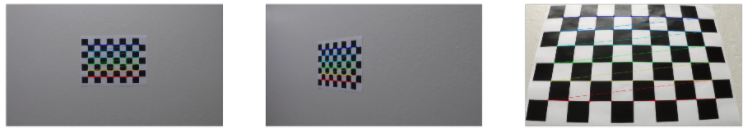

Finally, the camera matrix and the distortion coefficients and were found using **cv2.calibrateCamera** then undistorted images using **cv2.undistort** as follows:

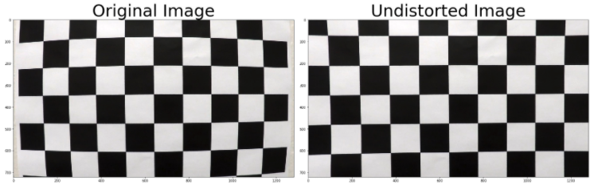

Also, test images were undistorted as shown below:

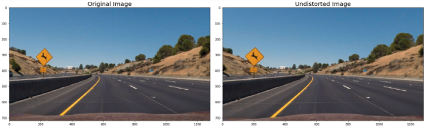

### Gradient Thresholding

Numerous parameters were tested on gradient transforms and the resulting binary images were visually checked. Bu using **cv2.Sobel** various filters were created. Also, set threshold values for both yellow and white lines to remain clearly in the picture and other details to be left out. One example below is shown from the results obtained through trial and error approach:

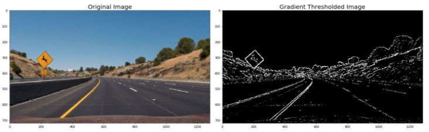

### Combined Gradient and Color Thresholding

#### Gradient and Color Thresholding
With the huristic approach, appropriate gradient and color conversion values were determined.  
The S channel is still doing a fairly robust job of picking up the lines under very different color and contrast conditions, while the other selections look messy.  
In general, the **S channel is preferable** because it is **more robust to changing conditions**.

It's worth noting, however, that **the R channel still does rather well on the white lines**, perhaps even better than the S channel.
In addition, **L channel** is performed well for the edges generated due to shadows.
As with gradients, it's worth considering how you might combine various color thresholds to make the most robust identification of the lines.  

The transformation trials are shown below:

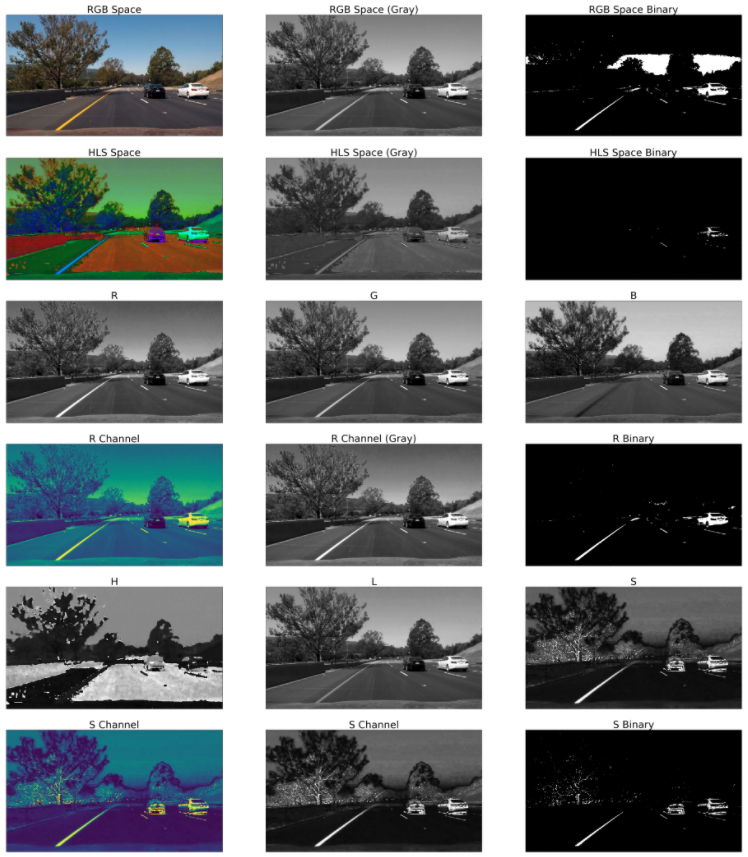

### Binary Thresholded Image

Using the appropriate parameters and threshold values obtained from gradient and color conversion experiments, a binary image creation parameter set was determined. R and G channels were used to identify yellow lines. L channel was included among the criteria to eliminate the bands caused by shading. Again, in order to make the lines clear, a threshold interval was determined for the S channel. These thresholds were determined for channel L as (50,255) and for channel S as (100,255). These values were determined on the test pictures by trial and error and yielded very good results for the test images. However, as we will see later in the videos, it did not perform perfectly in frames where lighting is very variable. As a result of the appropriate parameters and threshold ranges obtained from all trials, a combined gradient and color conversion function was obtained. A binary image obtained with this function is shown below.

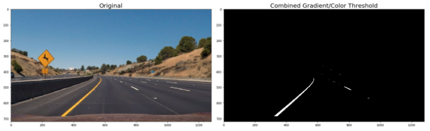

### Perspective Transform

To warp the image into birdeye view, a quadrangle area was defined based on approximate locations of the lanes. After determining the quadrangle area that defines the warping area, the transformation matrix was calculated by using **getPerspectiveTransform**. Then, based on the transformation matrix, regular image is transformed into birdeye view by using **cv2.warpPerspective** as shown below:

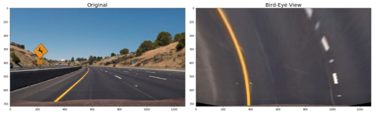

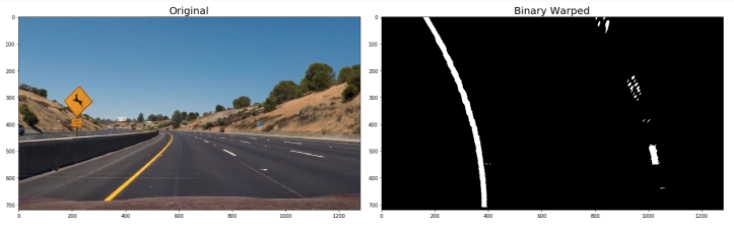

At this point, finally, the pipeline of the transformation from distorted image to calibrated and binary warped image is created.

### Lane Detection and Polynomial Fitting

To detect lane locations and fit a 2nd degree polynomial on it, sliding windows approach was used. First, approximate lane locations were found by tracking where peaks occurs in a histogram in which columns were summed as shown below: 

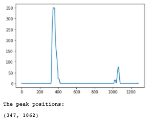

After detecting the peak positions from the histogram, sliding windows approach is used to lane curves as shown below.   
10 windows and 100 minimum pixels criteria were used. 

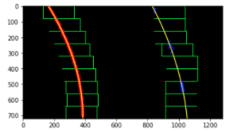

### Searcing Around Polynomials

At this point, a region around the fitted polynomials were determined based on a margin value as shown below.  
Here, the margin is 50.

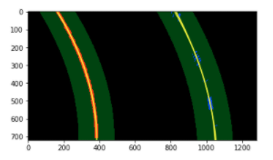

### Detecting Curvatures and the Free-Space between Lanes

Now, we are ready to detect the Free-Space between the lanes!  
First, the lane curvature and the offset from the center were calculated.  
Second, the Free-Space area between the lanes for the ego vehicle is painted by using **cv2.fillPoly**.  
Third, the Free-Space is transformed back into the regular perspective by using the inverse transformation matrix.  
And finally, the Free-Space and the lane information (curvature & offset from the center) was drawn onto the regular image (frame).

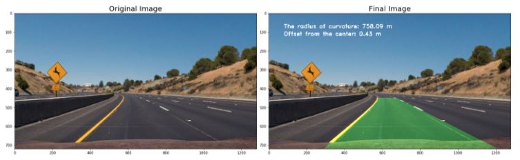

### Performance on the Videos

**Project Video**


**Challange Video**


**Harder Challange Video**


### Conclusion

**General Performance**
The overall pipeline worked well on the project video. However, it does not yield good results on challange and especially on harder challange videos. The reason behind why the pipeline does not yield good results on the challenge videos is that the pipeline is too sensitive lighting variations. Especially for the harder challenge video, not only the free-space but also the lanes do not fit well because immense variation in lighting.

**Reasons**
The pipeline is not consider the effects of the illumination. Although the shadows considered in the parameter selection phase, effects on the variation of illumination is not considered. In fact, any static parameter would fail because of this. Becase as long as lighting changes, not only brightness but also the color would be effected.

**Recommendations**
1. To overcome the problem because of the variations in the illumination, comibned thresholding must be done dynamically by creating a loop that would update the parameters and the thresholds according to current illumination in the frame. Or simply, learning-based methods can be used by feeding many frames that includes high variations in colors, shadows and illuminations into the learning model.  

2. 10 subsequent frames were taken into account for the lane detection and this failed in the region where color, ilumination, shadows (etc.) changes rapidly. More frames cen be taken into account or moving average can be used instead of just averaging the last 10 frames.


```python

```
